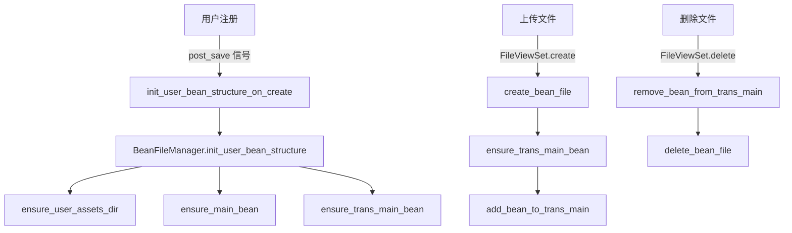

# 优化用户目录和文件处理流程

## 问题分析

当前代码存在以下问题：

1. **命名不一致**：

- `ensure_user_assets_dir` (ensure 前缀)
- `create_bean_file` (create 前缀)  
- `update_main_bean_include` (update 前缀，但实际也负责创建)
- `update_trans_main_bean_include` (update 前缀)

2. **职责混乱**：

- `update_main_bean_include` 既创建 main.bean（如果不存在）又更新 include（如果存在）
- `update_trans_main_bean_include` 在文件不存在时会抛出 FileNotFoundError

3. **初始化缺失**：

- 用户注册时没有创建主 `main.bean` 文件
- `trans/main.bean` 可能在首次使用时不存在

## 优化方案

### 1. 统一命名规范

采用以下命名约定：

- **`ensure_*`**: 确保目录/文件存在（幂等操作，创建如果不存在）
- **`create_*`**: 创建新的文件/资源（如果已存在则跳过或报错）
- **`get_*`**: 获取路径（不创建）
- **`init_*`**: 初始化完整结构（一次性操作）

### 2. 重新组织 BeanFileManager 方法

在 [`Beancount-Trans-Backend/project/utils/file.py`](Beancount-Trans-Backend/project/utils/file.py) 中：

#### 2.1 目录相关方法（保持现状）

- `get_user_assets_path()` - 获取路径（不变）
- `ensure_user_assets_dir()` - 确保目录存在（不变，命名已正确）

#### 2.2 文件路径获取方法（保持现状）

- `get_bean_file_path()` - 获取 bean 文件路径（不变）
- `get_main_bean_path()` - 获取 main.bean 路径（不变）
- `get_trans_main_bean_path()` - 获取 trans/main.bean 路径（不变）

#### 2.3 文件初始化方法（新增/重构）

- **新增 `init_user_bean_structure(user_or_username)`**: 
- 初始化完整的用户账本文件结构
- 创建用户目录
- 创建主 `main.bean`（如果不存在）
- 创建 `trans/` 目录和 `trans/main.bean`（如果不存在）
- 幂等操作
- **重构 `ensure_main_bean(user_or_username)`**（原 `update_main_bean_include`）:
- 重命名为更明确的 `ensure_main_bean`
- 确保 main.bean 存在，如果不存在则创建
- 确保包含 `include "trans/main.bean"`
- **重构 `ensure_trans_main_bean(user_or_username)`**（新增）:
- 确保 trans/main.bean 存在
- 如果不存在则创建空文件（带注释头）

#### 2.4 文件操作方法（重命名）

- **保留 `create_bean_file()`**: 创建单个 bean 文件（命名正确）
- **重构 `add_bean_to_trans_main()`**（原 `update_trans_main_bean_include`）:
- 重命名为更明确的 `add_bean_to_trans_main` / `remove_bean_from_trans_main`
- 内部调用 `ensure_trans_main_bean()` 确保文件存在
- 职责：添加/删除 include 语句

#### 2.5 其他方法（保持现状）

- `delete_bean_file()` - 删除 bean 文件（不变）
- `clear_bean_file()` - 清空 bean 文件（不变）
- `update_main_bean_username()` - 更新用户名（不变）
- `rename_user_directory()` - 重命名目录（不变）

### 3. 修复信号处理器

在 [`Beancount-Trans-Backend/project/apps/file_manager/signals.py`](Beancount-Trans-Backend/project/apps/file_manager/signals.py) 中：

- **新增 `init_user_bean_structure_on_create` 信号处理器**:
- 用户创建时自动初始化完整的账本文件结构
- 调用 `BeanFileManager.init_user_bean_structure(user)`
- **更新 `create_sample_files_for_new_user`**:
- 移除文件创建逻辑（现在由 `init_user_bean_structure` 处理）
- 只负责创建示例文件的数据库记录和 bean 文件
- 使用新的 `add_bean_to_trans_main()` 方法

### 4. 更新调用点

查找并更新所有调用旧方法的地方：

- `file_manager/views.py` - FileViewSet.create()
- `file_manager/signals.py` - create_sample_files_for_new_user()
- `git_repository/services.py` - _rebuild_standard_main_bean()
- 其他可能的调用点

### 5. 方法流程图

## 实施步骤

1. 在 `BeanFileManager` 中新增 `init_user_bean_structure()` 方法
2. 重构并重命名现有方法：

- `update_main_bean_include` → `ensure_main_bean`
- `update_trans_main_bean_include` → `add_bean_to_trans_main` / `remove_bean_from_trans_main`
- 新增 `ensure_trans_main_bean()` 辅助方法

3. 修复 `add_bean_to_trans_main()` 中的文件不存在 bug
4. 在信号处理器中添加 `init_user_bean_structure_on_create`
5. 更新所有调用点以使用新方法
6. 确保向后兼容（保留旧方法作为别名或完全移除并更新所有调用）

## 文件变更清单

- `Beancount-Trans-Backend/project/utils/file.py` - 重构 BeanFileManager 类
- `Beancount-Trans-Backend/project/apps/file_manager/signals.py` - 添加初始化信号处理器
- `Beancount-Trans-Backend/project/apps/file_manager/views.py` - 更新方法调用
- `Beancount-Trans-Backend/project/apps/git_repository/services.py` - 更新方法调用

## 注意事项

- 所有方法必须是幂等的（可重复调用不影响结果）