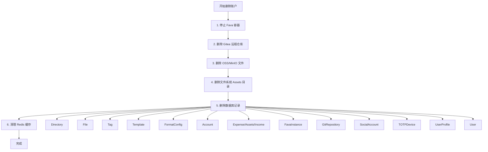

# 删除账户清理内容分析

## 概述

分析删除账户时需要清理的所有资源，包括数据库记录、文件系统、外部服务（Gitea、OSS/MinIO）、Docker 容器等，并检查当前实现是否完整。

## 当前实现分析

### 已实现的清理（`Beancount-Trans-Backend/project/apps/authentication/views.py:759-823`）

当前 `delete_account` 方法已清理以下内容：

1. **数据库记录**：

- ✅ `Account`（账户配置）
- ✅ `Expense`, `Assets`, `Income`（映射关系）
- ✅ `File`（文件记录）
- ✅ `SocialAccount`（社交账号绑定）
- ✅ `TOTPDevice`（双因素认证设备）
- ✅ `UserProfile`（用户配置）
- ✅ `User`（用户本身）

### 遗漏的清理项

#### 1. 文件系统资源

**Assets/{用户目录}**

- **状态**：❌ 未清理
- **位置**：`Beancount-Trans-Backend/Assets/{username}` 或 `Assets/{repo_name}`
- **影响**：用户目录及其所有文件（包括 `trans/` 目录和 `.bean` 文件）残留在服务器上
- **建议**：删除前保存 `username`，删除用户后清理目录

#### 2. Git 相关资源

**Gitea 远程仓库**

- **状态**：❌ 未清理
- **位置**：Gitea 服务器上的远程仓库
- **影响**：如果用户启用了 Git 功能，远程仓库不会被删除
- **已有方法**：`PlatformGitService.delete_user_repository()` (`Beancount-Trans-Backend/project/apps/git_repository/services.py:550`)
- **建议**：在删除用户前检查是否有 `git_repo`，如有则调用 `delete_user_repository()`

**GitRepository 数据库记录**

- **状态**：⚠️ 部分清理（通过 CASCADE 自动删除，但需要先删除 Gitea 仓库）
- **位置**：`GitRepository` 模型
- **影响**：如果先删除用户，GitRepository 会通过 CASCADE 删除，但 Gitea 远程仓库可能残留

#### 3. 对象存储（OSS/MinIO）资源

**OSS/MinIO 中的文件**

- **状态**：❌ 未清理
- **位置**：OSS/MinIO 存储桶中的文件
- **影响**：`File` 模型删除时，存储中的实际文件未被删除
- **原因**：`delete_account` 直接删除 `File` 对象，没有调用存储删除逻辑
- **参考**：`DirectoryViewSet._delete_directory_files()` (`Beancount-Trans-Backend/project/apps/file_manager/views.py:91-112`) 有正确的删除逻辑
- **建议**：删除 `File` 前，先遍历用户的文件，删除 OSS/MinIO 中的实际文件

#### 4. 数据库模型（CASCADE 未覆盖）

**Directory（目录）**

- **状态**：❌ 未清理
- **位置**：`Directory` 模型 (`Beancount-Trans-Backend/project/apps/file_manager/models.py:5`)
- **影响**：`Directory` 有 `owner` 字段，但 `File` 删除不会自动删除 `Directory`
- **建议**：显式删除 `Directory.objects.filter(owner=user).delete()`

**Tag（标签）**

- **状态**：❌ 未清理
- **位置**：`Tag` 模型 (`Beancount-Trans-Backend/project/apps/tags/models.py:7`)
- **影响**：用户创建的标签不会被删除
- **建议**：删除 `Tag.objects.filter(owner=user).delete()`

**Template（模板）**

- **状态**：❌ 未清理
- **位置**：`Template` 模型 (`Beancount-Trans-Backend/project/apps/maps/models.py:60`)
- **影响**：用户创建的映射模板不会被删除
- **建议**：删除 `Template.objects.filter(owner=user).delete()`

**FormatConfig（格式化配置）**

- **状态**：❌ 未清理
- **位置**：`FormatConfig` 模型 (`Beancount-Trans-Backend/project/apps/translate/models.py:8`)
- **影响**：用户的格式化配置不会被删除
- **建议**：删除 `FormatConfig.objects.filter(owner=user).delete()`

**FavaInstance（Fava 实例）**

- **状态**：❌ 未清理
- **位置**：`FavaInstance` 模型 (`Beancount-Trans-Backend/project/apps/fava_instances/models.py:6`)
- **影响**：用户的 Fava 容器实例不会被停止和删除
- **建议**：

1. 停止所有运行中的 Docker 容器
2. 删除 `FavaInstance.objects.filter(owner=user).delete()`

- **参考**：`FavaStopView` (`Beancount-Trans-Backend/project/apps/fava_instances/views.py:77-134`) 有停止容器的逻辑

#### 5. 其他资源

**ParseFile（解析文件状态）**

- **状态**：✅ 自动清理（通过 `File` 的 CASCADE）
- **位置**：`ParseFile` 模型 (`Beancount-Trans-Backend/project/apps/translate/models.py:85`)
- **说明**：`ParseFile` 与 `File` 是 `OneToOneField`，`File` 删除时会自动删除

**Celery 任务**

- **状态**：⚠️ 无法直接清理
- **影响**：用户相关的 Celery 任务可能仍在队列中
- **建议**：任务执行时检查用户是否存在，如果不存在则跳过

**Redis 缓存**

- **状态**：⚠️ 可能残留
- **影响**：用户相关的缓存数据可能残留在 Redis 中
- **建议**：删除用户时清理相关缓存键（如 `UserProfile.get_email_code_cache_key()`）

**JWT Token**

- **状态**：⚠️ 无法直接撤销
- **影响**：已签发的 JWT Token 在过期前仍然有效
- **建议**：如果使用了 Token 黑名单，将用户的 Token 加入黑名单

## 清理流程建议

### 推荐的删除顺序

### 实现要点

1. **事务处理**：数据库删除操作应在事务中执行
2. **错误处理**：外部资源删除失败不应阻止数据库删除（记录日志并继续）
3. **顺序重要**：先删除外部资源，再删除数据库记录
4. **幂等性**：确保删除操作可以安全重试

## 总结

当前实现**仅清理了部分数据库记录**，遗漏了以下重要资源：

1. ❌ 文件系统：Assets 目录
2. ❌ Git：Gitea 远程仓库
3. ❌ 对象存储：OSS/MinIO 文件
4. ❌ 数据库：Directory、Tag、Template、FormatConfig、FavaInstance
5. ⚠️ Docker：Fava 容器
6. ⚠️ 缓存：Redis 缓存