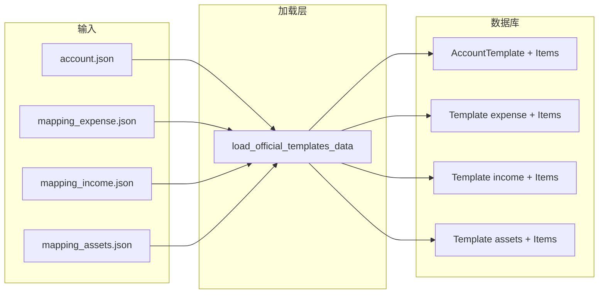

# 官方模板 JSON 化与导入流程

## 目标

- 官方模板数据存放到 JSON 文件，便于用 Git 管理、diff 和随时调整。
- 实现「从 JSON 目录加载 → 写入数据库」的流程，不依赖写死在代码里的大段数据。
- 保持现有 `init_official_templates` 行为可用：无 JSON 时仍用内嵌数据（可选），有 JSON 时优先用 JSON。

---

## 一、JSON 文件目录与约定

**目录位置**：`Beancount-Trans-Backend/project/fixtures/official_templates/`

（在 `project/` 下新增 `fixtures/official_templates/`，与现有 `project/apps/translate/fixtures/` 等区分，专门放「官方模板」数据。）

**文件列表与用途**：


| 文件                     | 用途                         |
| ---------------------- | -------------------------- |
| `account.json`         | 官方账户模板（名称、描述、版本、说明 + 账户列表） |
| `mapping_expense.json` | 官方支出映射模板                   |
| `mapping_income.json`  | 官方收入映射模板                   |
| `mapping_assets.json`  | 官方资产映射模板                   |


**路径解析**：在管理命令中通过 `settings.BASE_DIR` 或 `Path(__file__).resolve().parent` 向上定位到 `project/`，再拼接 `fixtures/official_templates/`，避免写死绝对路径。

---

## 二、JSON 结构定义（仅结构，数据由你自填）

### 1. `account.json`

对应 [AccountTemplate](Beancount-Trans-Backend/project/apps/account/models.py) + [AccountTemplateItem](Beancount-Trans-Backend/project/apps/account/models.py)。

```json
{
  "name": "中国用户标准账户模板",
  "description": "适用于中国用户的标准 Beancount 账户结构",
  "version": "1.0.0",
  "update_notes": null,
  "items": [
    {
      "account_path": "Assets",
      "enable": true
    },
    {
      "account_path": "Assets:Savings",
      "enable": true,
      "reconciliation_cycle_unit": null,
      "reconciliation_cycle_interval": null
    }
  ]
}
```

- `items[].account_path`：必填。  
- `items[].enable`：可选，默认 `true`。  
- `items[].reconciliation_cycle_unit` / `reconciliation_cycle_interval`：可选；若存在需成对且合法（与现有 `AccountTemplateItem.clean()` 一致）。

### 2. `mapping_expense.json`

对应 [Template](Beancount-Trans-Backend/project/apps/maps/models.py)（type=expense）+ [TemplateItem](Beancount-Trans-Backend/project/apps/maps/models.py)。

```json
{
  "name": "官方支出映射",
  "description": "中国用户常用支出映射",
  "version": "1.0.0",
  "update_notes": null,
  "items": [
    {
      "key": "美团",
      "payee": "美团",
      "account": "Expenses:Food",
      "currency": ""
    }
  ]
}
```

- `items[].key`：必填。  
- `payee` / `account` / `currency`：可选，空串或省略时写入 DB 为 null 或空。

### 3. `mapping_income.json`

```json
{
  "name": "官方收入映射",
  "description": "中国用户常用收入映射",
  "version": "1.0.0",
  "update_notes": null,
  "items": [
    {
      "key": "红包",
      "payer": null,
      "account": "Income:RedPacket:Personal"
    }
  ]
}
```

- `items[].key`、`items[].account` 必填；`payer` 可选。

### 4. `mapping_assets.json`

```json
{
  "name": "官方资产映射",
  "description": "中国用户常用资产映射",
  "version": "1.0.0",
  "update_notes": null,
  "items": [
    {
      "key": "零钱通",
      "full": "微信零钱通",
      "account": "Assets:Savings:Web:WechatFund"
    }
  ]
}
```

- `items[].key`、`items[].full`、`items[].account` 必填（TemplateItem 中 `full` 在资产映射中通常有值）。

字段命名与 DB 一致：JSON 用 `account` 表示账户路径，对应 `TemplateItem.account`。

---

## 三、加载流程设计




- **加载层**：根据「fixture 目录 + 上述文件名」读取 JSON，做基本校验（存在性、必填字段、类型），返回结构化 dict/list，不依赖 Django 模型。
- **写入 DB**：沿用现有逻辑：若 `--force` 则先删后建；否则若已存在同名+官方则跳过。创建时 `is_official=True`、`is_public=True`，`owner=admin_user`。

---

## 四、实现要点（不写具体代码，只列改动点）

### 4.1 新增「fixture 目录」与占位 JSON

- 在 `project/` 下创建 `fixtures/official_templates/`。
- 放入 4 个 JSON 文件，内容可为「仅满足上述 schema 的占位」（例如账户 2～3 条、每种映射 1～2 条），便于你之后替换为完整数据。

### 4.2 加载逻辑（建议独立模块）

- 新建模块，例如：`project/apps/account/management/commands/official_templates_loader.py`（或放在 `project/utils/`，若希望与 account/maps 解耦）。
- 职责：
  - 解析 fixture 目录路径（基于 `BASE_DIR` 或命令所在包向上定位到 `project/`）。
  - 提供函数：`load_official_account_data()`、`load_official_mapping_data(template_type)`（或一个统一入口返回 `{ "account": {...}, "mapping_expense": {...}, ... }`）。
  - 读取 JSON、校验必要字段、返回 Python 字典/列表；文件不存在时返回 `None`（或由调用方根据策略决定是否回退到内嵌数据）。

### 4.3 修改 `init_official_templates` 命令

- 文件：[init_official_templates.py](Beancount-Trans-Backend/project/apps/account/management/commands/init_official_templates.py)。
- 在 `_create_official_account_template(admin_user, force)` 中：
  - 先调用加载模块：若存在 `account.json` 则用其返回的数据（name、description、version、update_notes、items）创建 `AccountTemplate` 与 `AccountTemplateItem`。
  - 若不存在或加载失败，则使用当前命令内嵌的 `standard_accounts` 等逻辑（保持向后兼容）。
- 在 `_create_official_mapping_templates(admin_user, force)` 中：
  - 对 expense/income/assets 三种 type 分别检查对应 JSON 是否存在；若存在则用 JSON 数据创建 `Template` + `TemplateItem`，否则使用现有内嵌元组列表。
- 创建模板时，`owner=admin_user`，`is_official=True`，`is_public=True`；版本与说明从 JSON 的 `version`、`update_notes` 读取。

### 4.4 可选：仅从 JSON 导入的命令

- 若希望「只刷新官方模板、不碰 admin 用户与案例文件」，可新增子命令或独立命令，例如：`load_official_templates --force`，仅执行「从 JSON 加载 → 删除旧官方模板（若 --force）→ 创建新官方模板」，不创建 admin、不应用模板到用户、不写 FormatConfig、不创建案例文件。  
- 若你确认不需要，可暂不实现，只做「init 时优先读 JSON」即可。

---

## 五、文档与使用方式

- 在 [QUICK_REFERENCE.md](Beancount-Trans-Backend/docs/QUICK_REFERENCE.md) 或 README 中补充：
  - 官方模板 JSON 所在目录：`project/fixtures/official_templates/`。
  - 各文件 schema 说明（可指向本计划中的结构）。
  - 更新模板后执行：`python manage.py init_official_templates --force`（会重建官方模板并覆盖）；若实现 `load_official_templates`，则写：可仅运行 `load_official_templates --force` 更新模板。
- 在 `fixtures/official_templates/` 下增加简短 `README.md`：说明四个文件的用途、字段含义、以及「数据自填」即可。

---

## 六、小结


| 项   | 内容                                                                                |
| --- | --------------------------------------------------------------------------------- |
| 目录  | `project/fixtures/official_templates/`                                            |
| 文件  | `account.json`、`mapping_expense.json`、`mapping_income.json`、`mapping_assets.json` |
| 结构  | 上述 JSON schema（占位数据由你后续填充）                                                        |
| 加载  | 独立 loader 模块，按目录+文件名读取并校验，返回结构化数据                                                 |
| 接入  | `init_official_templates` 优先使用 JSON，缺失时回退到现有内嵌数据                                  |
| 可选  | 单独 `load_official_templates` 命令仅更新官方模板，不碰 admin/案例等                               |


这样你可以随时编辑 JSON、提交到 Git，并通过一条命令刷新数据库中的官方模板，无需改 Python 代码。