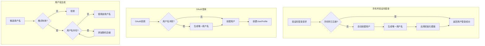

# 用户名唯一性完善计划

## 问题分析

根据代码分析，项目中存在以下需要解决的问题：| 场景 | 当前行为 | 期望行为 ||------|----------|----------|| 手机号验证码登录（未注册） | 返回错误 | 自动注册 || 手机号注册（提供用户名） | 允许设置用户名和密码 | 移除此功能，只自动生成 || 手机号注册（用户名冲突） | 自动生成唯一用户名 | 保持现有行为 || OAuth 注册（用户名冲突） | allauth 默认行为 | 自动添加随机后缀 || 用户修改用户名（冲突） | 返回错误 | 保持现有行为（返回错误） || 用户名格式 | 无限制 | 禁止 `xxxxxx-assets` 格式 |

## 实现方案

### 1. 创建统一的用户名生成工具

在 [`views.py`](Beancount-Trans-Backend/project/apps/authentication/views.py) 中已有 `_generate_available_username` 方法，需要将其提取为公共工具函数，供多处使用。

```python
# 位置：project/apps/authentication/utils.py（新建）
def generate_unique_username(base_username: str) -> str:
    """根据候选值生成唯一用户名，冲突时自动添加随机后缀"""
```


### 2. 手机号验证码登录自动注册

修改 [`views.py`](Beancount-Trans-Backend/project/apps/authentication/views.py) 中的 `login_by_code` 方法：

- 当 `authenticate` 返回 `None` 但验证码验证成功时，自动创建用户
- 用户名基于手机号生成（如 `user_138xxxx1234`）
- 应用官方账户模板和映射模板

### 3. 移除手机号注册时的用户名和密码字段

修改 [`serializers.py`](Beancount-Trans-Backend/project/apps/authentication/serializers.py) 中的 `PhoneRegisterSerializer`：

- 移除 `username` 字段
- 移除 `password` 字段
- 保留 `email` 字段（可选）

同步修改 `register` 视图，移除相关处理逻辑。

### 4. OAuth 注册用户名冲突处理

修改 [`adapters.py`](Beancount-Trans-Backend/project/apps/authentication/adapters.py) 中的 `CustomSocialAccountAdapter`：

- 重写 `populate_user` 方法，检查 OAuth 提供的用户名是否冲突
- 冲突时使用 `generate_unique_username` 生成唯一用户名

### 5. 添加用户名格式验证

在 [`serializers.py`](Beancount-Trans-Backend/project/apps/authentication/serializers.py) 和 [`adapters.py`](Beancount-Trans-Backend/project/apps/authentication/adapters.py) 中添加验证：

- 禁止用户名匹配 `^[a-f0-9]{6,}-assets$` 正则模式
- 此格式保留给 Git 仓库目录名使用

### 6. 更新测试用例

更新相关测试以验证新行为：

- 手机号验证码登录自动注册测试
- 用户名冲突自动生成后缀测试
- 用户名格式限制测试

## 文件变更清单

| 文件 | 变更类型 | 说明 ||------|----------|------|| `authentication/utils.py` | 新建 | 统一的用户名生成工具 || `authentication/views.py` | 修改 | 手机号登录自动注册逻辑 || `authentication/serializers.py` | 修改 | 移除注册字段、添加格式验证 || `authentication/adapters.py` | 修改 | OAuth 用户名冲突处理 || `authentication/tests/` | 修改 | 更新测试用例 |

## 数据流程图

