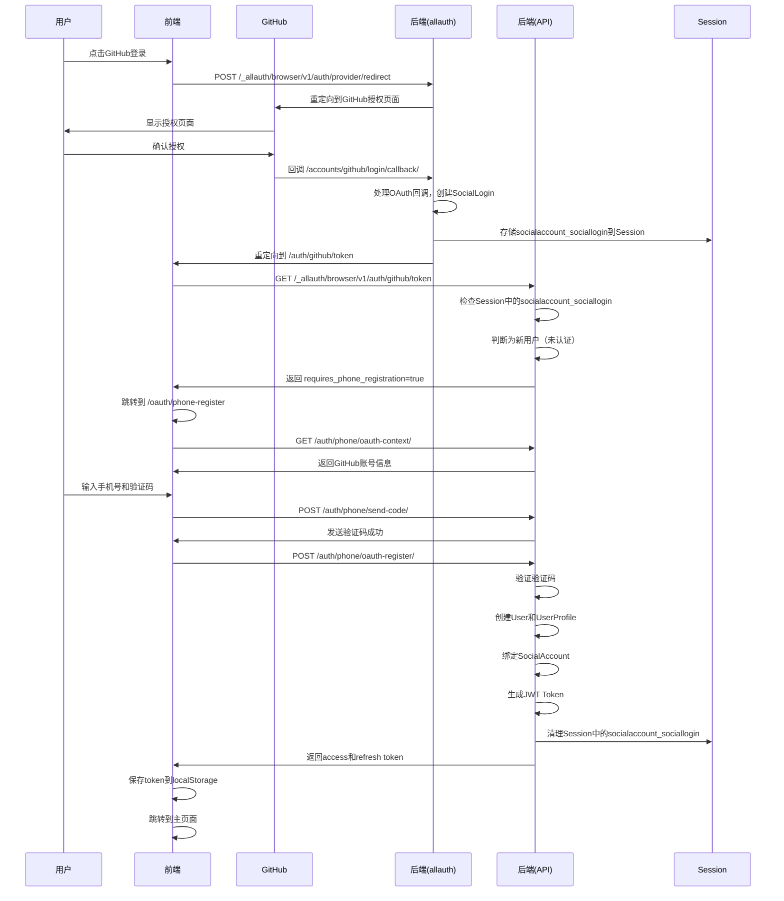
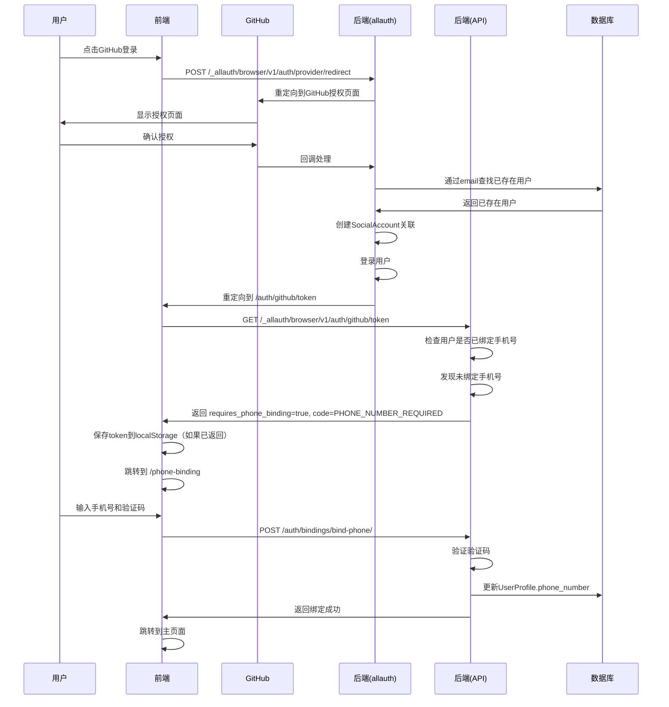
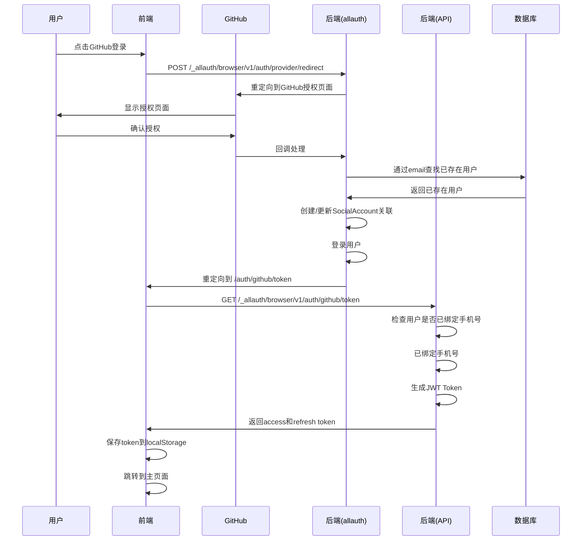

# OAuth认证登录全流程文档

## 1. 概述

### 1.1 OAuth认证在系统中的作用

OAuth认证是本系统的重要登录方式之一，允许用户通过GitHub、Google等第三方平台账号快速登录系统。系统采用**强制手机号绑定**的设计理念，确保所有用户（包括OAuth登录用户）都必须绑定手机号才能正常使用系统功能。

### 1.2 技术栈

- **django-allauth**: Django的社交账号认证库，处理OAuth流程
- **allauth-headless**: allauth的无头模式，适配前后端分离架构
- **JWT (JSON Web Token)**: 使用`rest_framework_simplejwt`生成访问令牌和刷新令牌
- **Session**: 用于临时存储OAuth回调信息

### 1.3 核心设计理念

1. **强制手机号绑定**: 所有用户必须绑定手机号，包括OAuth登录的新用户
2. **禁用自动注册**: 通过`SOCIALACCOUNT_AUTO_SIGNUP = False`禁用OAuth自动注册
3. **统一认证流程**: OAuth登录后必须完成手机号验证才能完成注册/登录
4. **多账号绑定**: 支持同一用户绑定多个登录方式（GitHub、Google、手机号、密码等）

---

## 2. 完整流程图

### 2.1 新用户首次OAuth登录流程



### 2.2 已存在用户OAuth登录流程（未绑定手机号）



### 2.3 已绑定手机号用户OAuth登录流程



---

## 3. 前端流程详解

### 3.1 登录页面发起OAuth请求

**文件位置**: `Beancount-Trans-Frontend/src/views/login/index.vue`

用户点击"GitHub 登录"按钮时，前端创建一个隐藏的表单并提交到后端：

```typescript
const loginWithGitHub = () => {
  const providerId = 'github'
  const callbackURL = window.location.origin + '/auth/github/token'

  const form = document.createElement('form')
  form.method = 'POST'
  form.action = apiUrl + '/_allauth/browser/v1/auth/provider/redirect'
  
  // 添加provider参数
  const providerInput = document.createElement('input')
  providerInput.type = 'hidden'
  providerInput.name = 'provider'
  providerInput.value = providerId
  
  // 添加callback_url参数
  const callbackInput = document.createElement('input')
  callbackInput.type = 'hidden'
  callbackInput.name = 'callback_url'
  callbackInput.value = callbackURL
  
  // 添加process参数
  const processInput = document.createElement('input')
  processInput.type = 'hidden'
  processInput.name = 'process'
  processInput.value = 'login'
  
  form.appendChild(providerInput)
  form.appendChild(callbackInput)
  form.appendChild(processInput)
  document.body.appendChild(form)
  form.submit()
}
```

**关键点**:
- 使用POST表单提交，确保CSRF token正确传递
- `callback_url`指定OAuth回调后的前端路由
- `process=login`表示这是登录流程

### 3.2 GitHub回调处理

**文件位置**: `Beancount-Trans-Frontend/src/components/GitHubCallback.vue`

GitHub授权完成后，会重定向到`/auth/github/token`路由，该组件负责处理回调：

```typescript
onMounted(async () => {
  try {
    // 向后端请求用户信息
    const response = await axios.get(apiUrl + '/_allauth/browser/v1/auth/github/token', {
      withCredentials: true, // 携带cookies
    })

    const data = response.data

    // 场景1: 新用户，需要手机号注册
    if (data.requires_phone_registration || data.code === 'PHONE_REGISTRATION_REQUIRED') {
      sessionStorage.setItem('oauthProvider', data.provider || 'github')
      sessionStorage.setItem('oauthAccount', JSON.stringify(data.account || {}))
      router.push('/oauth/phone-register')
      return
    }

    // 场景2: 已存在用户但未绑定手机号
    if (data.requires_phone_binding || data.code === 'PHONE_NUMBER_REQUIRED') {
      if (data.access) {
        const { setAuthTokens } = await import('@/utils/auth')
        setAuthTokens(data.access, data.refresh || '', data.username)
      }
      router.push('/phone-binding')
      return
    }

    // 场景3: 正常登录成功
    if (data.access && data.refresh) {
      const { setAuthTokens } = await import('@/utils/auth')
      setAuthTokens(data.access, data.refresh, data.username)
    }

    // 首次登录设置引导标记
    if (data.is_new_user) {
      localStorage.setItem('start_tour', 'true')
    }

    ElMessage.success("GitHub 登录成功")
    router.push('/file')
  } catch (error: any) {
    // 错误处理...
  }
})
```

**关键点**:
- 使用`withCredentials: true`确保携带Session cookies
- 根据后端返回的不同状态码跳转到不同页面
- 新用户信息存储在sessionStorage中供后续使用

### 3.3 OAuth手机号注册页面

**文件位置**: `Beancount-Trans-Frontend/src/views/oauth-phone-register/index.vue`

新用户完成GitHub授权后，需要在此页面完成手机号注册：

**流程**:
1. 页面加载时，从后端获取OAuth上下文信息：
   ```typescript
   const fetchContext = async () => {
     const resp = await axios.get(apiUrl + '/auth/phone/oauth-context/', { 
       withCredentials: true 
     })
     provider.value = resp.data?.provider || 'github'
     account.value = resp.data?.account || {}
   }
   ```

2. 用户输入手机号，点击"发送验证码"：
   ```typescript
   const sendCode = async () => {
     await axios.post(apiUrl + '/auth/phone/send-code/', {
       phone_number: normalizePhone(form.phone),
     })
   }
   ```

3. 用户输入验证码和其他信息，提交注册：
   ```typescript
   const handleSubmit = async () => {
     const payload = {
       phone_number: normalizePhone(form.phone),
       code: form.code.trim(),
       username: form.username.trim(), // 可选
       password: form.password.trim(), // 可选
       email: accountEmail.value,     // 从GitHub获取
     }
     
     const resp = await axios.post(
       apiUrl + '/auth/phone/oauth-register/', 
       payload, 
       { withCredentials: true }
     )
     
     // 保存token并跳转
     setAuthTokens(resp.data.access, resp.data.refresh, resp.data.user.username)
     router.push('/file')
   }
   ```

**关键点**:
- 用户名和密码都是可选的，系统会自动生成用户名
- 邮箱从GitHub账号信息中获取
- 必须使用`withCredentials: true`以访问Session中的socialaccount_sociallogin

### 3.4 手机号绑定页面

**文件位置**: `Beancount-Trans-Frontend/src/views/phone-binding/index.vue`

已存在用户（通过OAuth登录）但未绑定手机号时，需要在此页面绑定：

**流程**:
1. 检查用户是否已登录（通过localStorage中的token）
2. 发送验证码和绑定流程与注册类似，但调用的是`/auth/bindings/bind-phone/`接口
3. 绑定成功后，检查是否有待返回的路径（`redirectAfterPhoneBinding`）

**关键点**:
- 已登录用户和未登录用户使用同一个页面，通过`isLoggedIn`状态区分
- 绑定成功后恢复之前访问的页面

### 3.5 路由配置

**文件位置**: `Beancount-Trans-Frontend/src/routers.ts`

相关路由配置：

```typescript
{
  path: '/auth/github/token', 
  component: AuthenticateByGithubToken  // GitHubCallback组件
},
{
  path: '/oauth/phone-register', 
  name: 'oauthPhoneRegister', 
  component: OAuthPhoneRegister
},
{
  path: '/phone-binding', 
  name: 'phoneBinding', 
  component: PhoneBinding
}
```

路由守卫会检查手机号绑定状态，未绑定时会自动跳转到绑定页面。

---

## 4. 后端流程详解

### 4.1 allauth headless OAuth处理

**配置位置**: `project/settings/settings.py`

系统使用`allauth.headless`处理OAuth流程，关键配置：

```python
# Allauth Headless配置
HEADLESS_TOKEN_STRATEGY = "project.utils.token.JWTTokenStrategy"
HEADLESS_ADAPTER = "allauth.headless.adapter.DefaultHeadlessAdapter"

# OAuth配置
SOCIALACCOUNT_AUTO_SIGNUP = False  # 禁用自动注册
SOCIALACCOUNT_EMAIL_AUTHENTICATION = True
SOCIALACCOUNT_STORE_TOKENS = True
SOCIALACCOUNT_LOGIN_ON_GET = False

# GitHub OAuth配置
SOCIALACCOUNT_PROVIDERS = {
    'github': {
        'APPS': [{
            "client_id": GITHUB_CLIENT_ID,
            "secret": GITHUB_CLIENT_SECRET,
        }],
        'SCOPE': ['user', 'repo', 'read:org'],
        'METHOD': 'oauth2',
        'OAUTH_PKCE_ENABLED': True,
    },
}
```

**URL路由**: `project/urls.py`

```python
path("api/_allauth/", include("allauth.headless.urls")),
path('api/_allauth/browser/v1/auth/github/token', authenticateByToken, name='authenticateByGithubToken'),
path("api/accounts/", include("allauth.urls")),  # GitHub OAuth回调
```

**流程**:
1. 前端POST到`/_allauth/browser/v1/auth/provider/redirect`，后端重定向到GitHub授权页面
2. GitHub授权后回调到`/accounts/github/login/callback/`
3. allauth处理回调，创建`SocialLogin`对象并存储到Session
4. 重定向到前端指定的`callback_url`（`/auth/github/token`）

### 4.2 CustomSocialAccountAdapter适配器逻辑

**文件位置**: `project/apps/authentication/adapters.py`

自定义适配器控制OAuth登录行为：

```python
class CustomSocialAccountAdapter(DefaultSocialAccountAdapter):
    """自定义社交账号适配器，禁用自动注册，强制手机号绑定"""
    
    def is_open_for_signup(self, request, sociallogin):
        """禁用OAuth自动注册"""
        return False
    
    def pre_social_login(self, request, sociallogin):
        """OAuth登录前的处理"""
        # 如果用户已经存在（通过email关联）
        if sociallogin.is_existing:
            user = sociallogin.user
            try:
                profile = user.profile
                # 检查是否已绑定手机号
                if not profile.is_phone_verified():
                    logger.warning(f"用户 {user.username} 通过OAuth登录但未绑定手机号")
            except UserProfile.DoesNotExist:
                UserProfile.objects.create(user=user)
        
        # 对于新用户，不会自动创建用户
        return None
```

**关键点**:
- `is_open_for_signup`返回`False`，禁用自动注册
- `pre_social_login`中检查已存在用户的手机号绑定状态
- 新用户不会自动创建，需要后续手动注册

### 4.3 authenticateByToken视图处理

**文件位置**: `project/views.py`

这是OAuth回调后的关键处理点：

```python
def authenticateByToken(request):
    # 场景1: 用户已通过OAuth登录
    if request.user.is_authenticated:
        user = request.user
        is_new_user = user.last_login is None
        
        # 检查手机号绑定状态
        try:
            profile = user.profile
            phone_verified = profile.is_phone_verified()
        except AttributeError:
            profile = UserProfile.objects.create(user=user)
            phone_verified = False
        
        # 未绑定手机号，返回需要绑定
        if not phone_verified:
            return JsonResponse({
                'error': '请先绑定手机号',
                'code': 'PHONE_NUMBER_REQUIRED',
                'requires_phone_binding': True
            }, status=403)
        
        # 已绑定，生成JWT Token
        refresh = RefreshToken.for_user(user)
        return JsonResponse({
            'access': str(refresh.access_token),
            'refresh': str(refresh),
            'username': user.username,
            'is_new_user': is_new_user,
        })
    
    # 场景2: 新用户，Session中有待处理的社交登录
    else:
        serialized = request.session.get('socialaccount_sociallogin')
        if serialized:
            sociallogin = SocialLogin.deserialize(serialized)
            return JsonResponse({
                'requires_phone_registration': True,
                'code': 'PHONE_REGISTRATION_REQUIRED',
                'provider': sociallogin.account.provider,
                'account': {
                    'uid': sociallogin.account.uid,
                    'username': sociallogin.user.username,
                    'email': sociallogin.user.email,
                    'extra_data': sociallogin.account.extra_data,
                }
            }, status=200)
        
        return JsonResponse({'error': 'User not authenticated'}, status=401)
```

**关键点**:
- 已认证用户：检查手机号绑定状态，未绑定返回403
- 未认证用户：检查Session中的`socialaccount_sociallogin`，存在则返回需要注册
- 根据不同场景返回不同的状态码和错误信息

### 4.4 OAuth注册API

**文件位置**: `project/apps/authentication/views.py`

`oauth_register`方法处理新用户的OAuth注册：

```python
@action(detail=False, methods=['post'], url_path='oauth-register')
def oauth_register(self, request):
    """处理 GitHub OAuth 首次登录后的手机号注册"""
    # 从Session中获取SocialLogin
    sociallogin = self._get_sociallogin_from_session(request)
    if not sociallogin:
        return Response({'error': '未检测到待处理的社交登录'}, status=400)
    
    # 验证手机号验证码
    serializer = OAuthPhoneRegisterSerializer(data=request.data)
    serializer.is_valid(raise_exception=True)
    
    phone_number = serializer.validated_data['phone_number']
    code = serializer.validated_data['code']
    
    # 验证验证码
    temp_profile = UserProfile(phone_number=phone_number)
    if not temp_profile.verify_sms_code(code, phone_number):
        return Response({'error': '验证码错误或已过期'}, status=400)
    
    # 生成唯一用户名
    username = self._generate_available_username(
        serializer.validated_data.get('username') or 
        sociallogin.user.username or 
        sociallogin.account.extra_data.get('login')
    )
    
    # 创建用户
    with transaction.atomic():
        user = User(username=username, email=email)
        if password:
            user.set_password(password)
        else:
            user.set_unusable_password()
        user.save()
        
        # 创建UserProfile并绑定手机号
        profile = UserProfile.objects.create(
            user=user,
            phone_number=phone_number,
            phone_verified=True
        )
        
        # 绑定社交账号
        social_account = SocialAccount.objects.create(
            provider=sociallogin.account.provider,
            uid=sociallogin.account.uid,
            user=user,
            extra_data=sociallogin.account.extra_data
        )
        
        # 保存OAuth token
        if hasattr(sociallogin, 'token'):
            SocialToken.objects.create(
                account=social_account,
                app=social_app,
                token=sociallogin.token.token,
                token_secret=sociallogin.token.token_secret
            )
    
    # 清理Session
    self._clear_sociallogin_in_session(request)
    
    # 生成JWT Token
    refresh = RefreshToken.for_user(user)
    return Response({
        'access': str(refresh.access_token),
        'refresh': str(refresh),
        'user': {...}
    }, status=201)
```

**关键点**:
- 从Session中反序列化`SocialLogin`对象
- 验证手机号验证码
- 创建用户、UserProfile和SocialAccount
- 保存OAuth token供后续使用
- 清理Session中的临时数据
- 返回JWT Token

### 4.5 手机号绑定检查中间件

**文件位置**: `project/apps/authentication/middleware.py`

中间件确保所有已认证用户都绑定了手机号：

```python
class PhoneNumberRequiredMiddleware:
    """手机号绑定检查中间件"""
    
    EXCLUDED_PATHS = [
        '/api/auth/phone/send-code/',
        '/api/auth/phone/login-by-code/',
        '/api/auth/phone/register/',
        '/api/auth/bindings/bind-phone/',
        '/api/_allauth/',
        '/admin/',
    ]
    
    def __call__(self, request):
        if request.user.is_authenticated:
            if not self._is_excluded_path(request.path):
                try:
                    profile = request.user.profile
                    if not profile.is_phone_verified():
                        return JsonResponse({
                            'error': '请先绑定手机号',
                            'code': 'PHONE_NUMBER_REQUIRED',
                        }, status=403)
                except UserProfile.DoesNotExist:
                    UserProfile.objects.create(user=request.user)
                    return JsonResponse({
                        'error': '请先绑定手机号',
                        'code': 'PHONE_NUMBER_REQUIRED',
                    }, status=403)
        
        return self.get_response(request)
```

**关键点**:
- 只检查已认证用户
- 排除认证相关的API路径
- 未绑定手机号返回403错误
- 自动创建缺失的UserProfile

### 4.6 JWT Token策略

**文件位置**: `project/utils/token.py`

自定义JWT Token策略，集成到allauth headless：

```python
class JWTTokenStrategy(AbstractTokenStrategy):
    def create_access_token(self, request: HttpRequest) -> str:
        access_token = AccessToken.for_user(request.user)
        return str(access_token)
    
    def create_refresh_token(self, request: HttpRequest) -> str:
        refresh_token = RefreshToken.for_user(request.user)
        return str(refresh_token)
    
    def create_access_token_payload(self, request: HttpRequest) -> dict:
        access_token = self.create_access_token(request)
        refresh_token = self.create_refresh_token(request)
        
        return {
            'access_token': access_token,
            'refresh_token': refresh_token,
            'token_type': 'Bearer',
            'expires_in': expires_in,
        }
```

**配置**: `project/settings/settings.py`

```python
SIMPLE_JWT = {
    'ACCESS_TOKEN_LIFETIME': datetime.timedelta(hours=1),
    'REFRESH_TOKEN_LIFETIME': datetime.timedelta(days=3),
    'ROTATE_REFRESH_TOKENS': False,
    'BLACKLIST_AFTER_ROTATION': True,
    'AUTH_HEADER_TYPES': ('Bearer',),
}
```

